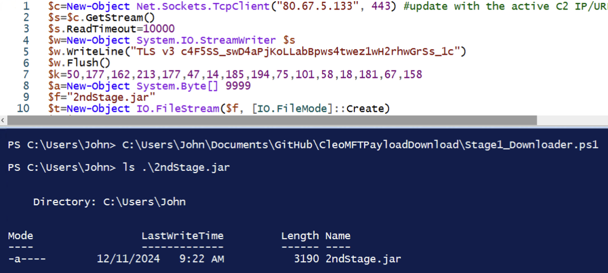
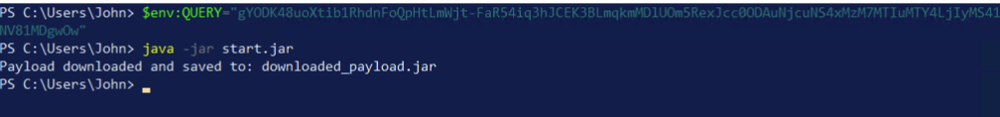

# Warning

Only execute this tool in a controlled and protected environment to avoid unexpected infection. Use at your own risk.

# CleoMFTPayloadDownload

This is a modified version of the 2nd stage JAR file in recent Cleo MFT incidents that will just connect to the C2 and download the 3rd stage JAR and save the file to disk instead of dynamically running the JAR automatically. In the real attacks, the 2nd stage JAR file is destroyed/overwritten and the 3rd stage is run in memory making it difficult to recover if the system has been restarted or powered off.

In order for this tool to properly run, the environmental variable Query must be set with the content from the 1st stage PowerShell payload. The decryption key to decode the 3rd payload is hardcoded into the 2nd stage JAR file. If the key has changed, you will need to download the 2nd stage JAR, recover the key, and then recompile the JAR with the appropriate key on line on 16 in start.java

# 2nd Stage PowerShell Downloader

If you do not have a copy of the 2nd stage JAR but have recovered the content from the 1st stage PowerShell script simply comment out the Start-Process line to just download the 2nd stage JAR file to disk.

Alternatively, you can leverage this PS script in this repo and change the C2, key, Query, and any other dynamic values to download the 2nd stage JAR.

# 3rd Stage Downloader

Make sure you set the Query variable from the associated 1st stage PowerShell script as that is where the downloader looks for the C2 information to download the 3rd stage JAR.

The decryption key for the 3rd stage JAR is hard coded into the second stage JAR within arrayOfByte1. Inspect the 2nd stage JAR file you acquired and make note of the arrayOfByte values.

\\

Update start.java to ensure:

-   arrayOfByte1 matches the data from the 2nd stage JAR.
-   aesKey matches the value listed in arrayOfByte2 from the 2nd stage JAR.
-   arrayOfByte4 matches the data from the 2nd stage JAR.

    

Compile your start.java file using *javac: javac start.java*

Package the class file into a JAR: *jar cfm start.jar MANIFEST.MF start.class*

**

Set the Query variable and run the JAR

3rd stage JAR will be downloaded to disk as downloaded_payload.jar

